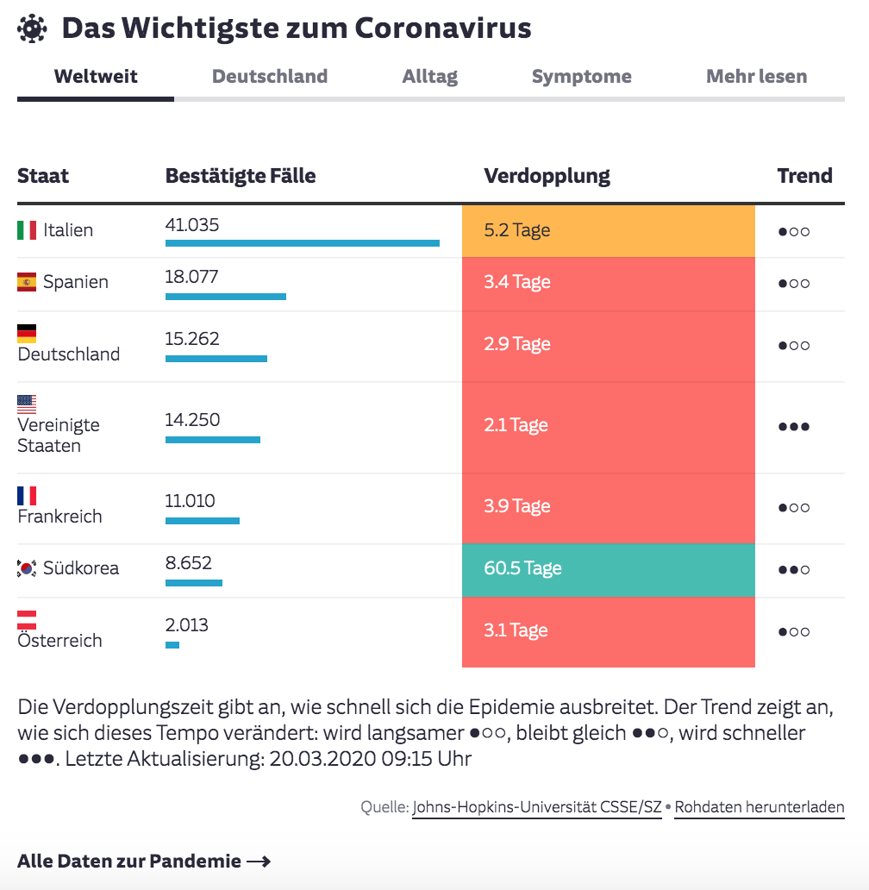
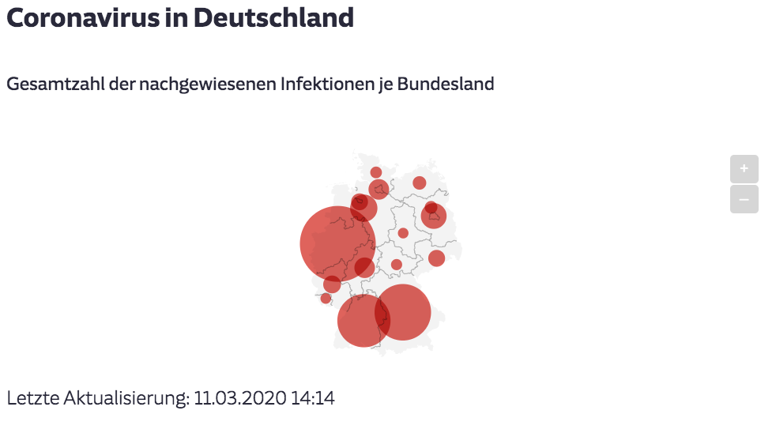
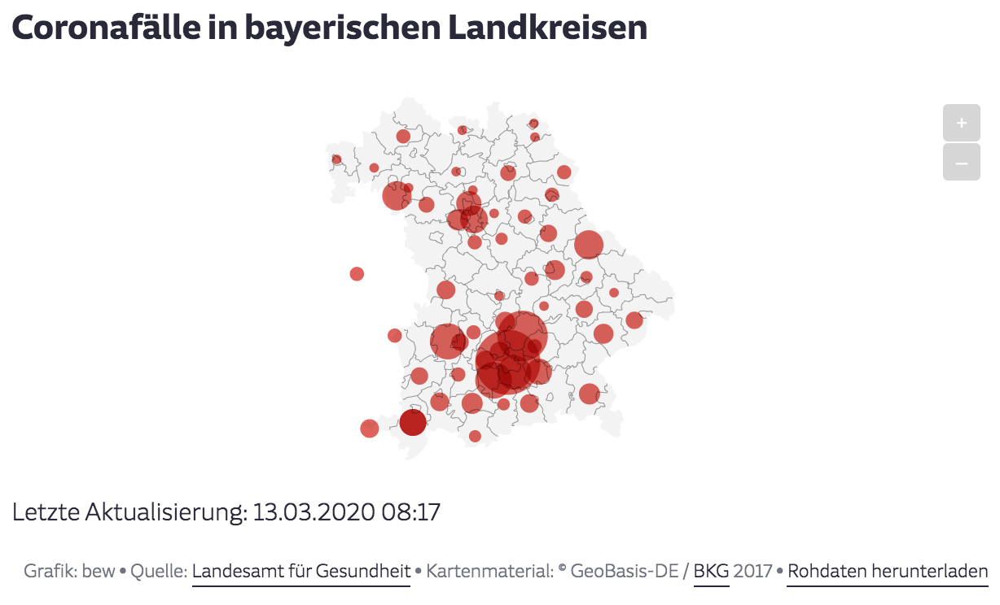
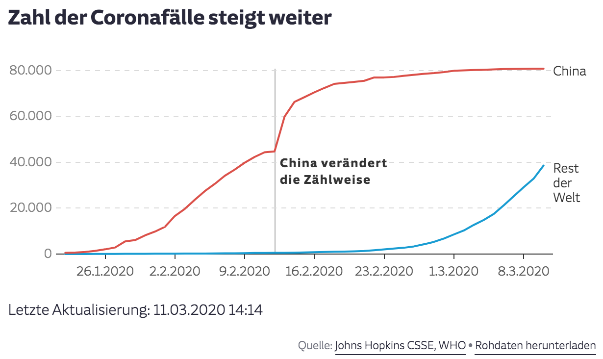
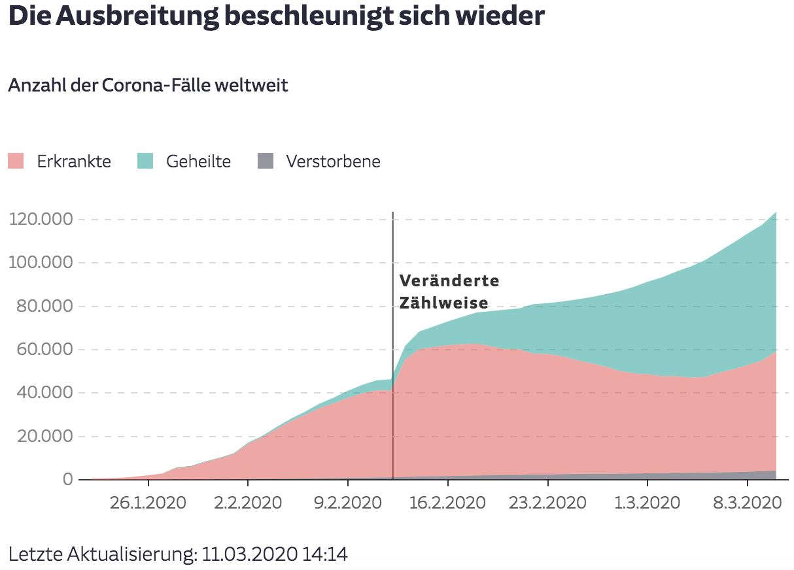
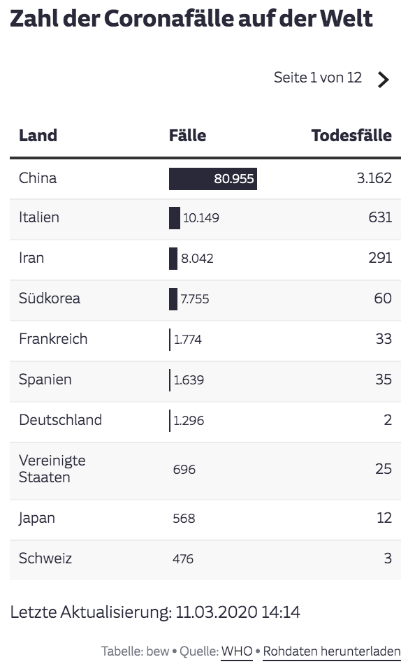
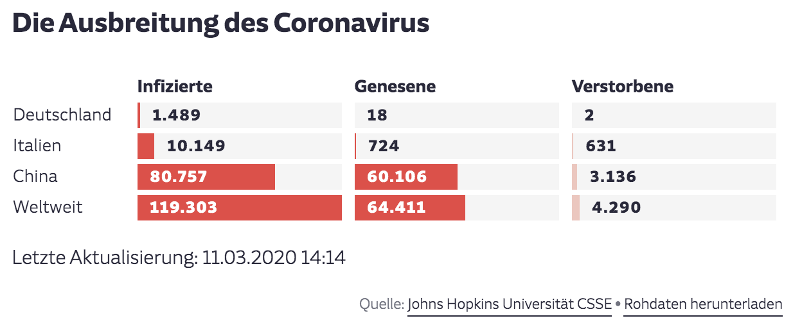
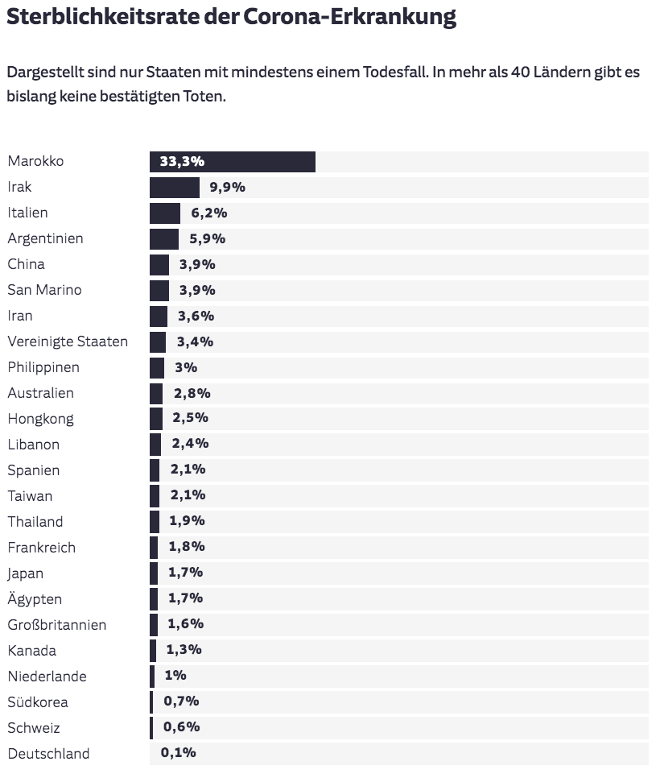
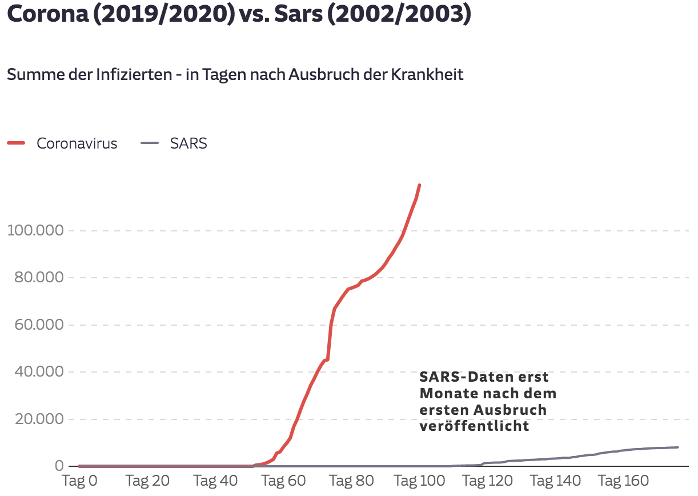

# Automate charts for the Covid-19 outbreak

Creates automated charts in Datawrapper for the spread of Covid-19.

## Prerequisites

### Installation

* You will need a Datawrapper-API-Key (which is set as a constant in `main.R`). You can find more on that [here](https://blog.datawrapper.de/new-api-Datawrapper-chart-creation-automation/).

### Usage

You can run this scripts from your machine, or put it on a server which has R and all required packages installed (check out the needs-call in `main.R` to find them).

* `main.R` contains all constants that need to be set beforehand. In the beginning of each function there is a `chart_id` which needs to be set to the correct Datawrapper-ID. This is quite a manual process but in ensures that there is always a correct mapping between script and chart.

* You might want to set up a Cronjob to run every hour e.g.: `0 * * * * Rscript [PATH TO THE MAIN.R]/main.R >> log.txt` (yes, there are a couple of logs written - just in case).

---

## Dashboard

[`create_dashboard.R`](functions/production/dashboard/create_dashboard.R)

We've created a dashboard for our website that shows the current case-count and calculated statistics on the doubling-speed and a trend indicator. [You can find the live chart here.](https://www.datawrapper.de/_/CwCm9/)

**Sources:** 

* Johns-Hopkins-Dashboard-Data - which is updated more often than the Github (https://www.arcgis.com/apps/opsdashboard/index.html#/bda7594740fd40299423467b48e9ecf6)

* Worldometers (https://www.worldometers.info/coronavirus/)

---

## Maps

We currently only show maps of the German Federal States and Bavarian Counties. We deprecated a map of the whole world when there had been cases everywhere - it is now shown as a Datawrapper table with bar charts (see below).

Both scripts are called in [`get_geographical_data.R`](functions/production/maps/get_geographical_data.R).

### German Federal States

[You can find the live map here.](https://www.datawrapper.de/_/OmFh7/)

[`map_german_states.R`](functions/production/maps/map_german_states.R)

**Source:** 

* our own research (combining sources like the RKI and state-level authorities in a Google Sheet)

### Create a map of Bavarian counties

[You can find the live map here.](https://www.datawrapper.de/_/nXJJh/)

[`map_bavaria_counties.R`](functions/production/maps/map_bavaria_counties.R)

This script maps the cases in Bavarian counties. It combines them with a translation table beforehand, to match county name with Lat and Lon-coordinates. Unfortunately the data source changes the names wildly each day (sometimes with a "Land"- or "Stadt"-suffix, sometimes without). So it needs a lot of manual correction.

**Source:** 

* Bayerisches Landesamt für Gesundheit (https://www.lgl.bayern.de/gesundheit/infektionsschutz/infektionskrankheiten_a_z/coronavirus/karte_coronavirus/index.htm)

---

## Charts

### Line chart of the cases

[`line_cases.R`](functions/production/charts/line_cases.R)

Showing the cases in China and Worldwide over time. [You can find the live chart here.](https://www.datawrapper.de/_/rhdL0/)

**Sources:** 

* John Hopkins CSSE / Github-data (https://github.com/CSSEGISandData/COVID-19/raw/master/csse_covid_19_data/csse_covid_19_time_series/time_series_19-covid-Confirmed.csv)

* For Germany: our own data

### Area chart comparing Cases, deaths and cured numbers

[`area_cases_vs_cured.R`](functions/production/charts/larea_cases_vs_cured.R)

Showing the cases, deaths and cured cum-sums over time. [You can find the live chart here.](https://www.datawrapper.de/_/9vAGe/)

**Source:** 

* John Hopkins CSSE / Github-data (https://github.com/CSSEGISandData/COVID-19/raw/master/csse_covid_19_data/csse_covid_19_time_series/)

### Table for all countries comparing Cases and deaths

[`table_world_cases_deaths.R`](functions/production/charts/table_world_cases_deaths.R)

Showing the cases and deaths for each country in a sorted table. [You can find the live chart here.](https://www.datawrapper.de/_/qYLoP/)

**Sources:** 

* Johns-Hopkins-Dashboard-Data - which is updated more often than the Github (https://www.arcgis.com/apps/opsdashboard/index.html#/bda7594740fd40299423467b48e9ecf6)

* Worldometers (https://www.worldometers.info/coronavirus/)

* For Germany: our own research

### Table for several countries comparing Cases and deaths

[`table_cases_deaths_recovered.R`](functions/production/charts/table_cases_deaths_recovered.R)

Showing the cases, recovered and deaths only for China, Italy, Germany and the World right now in a table. [You can find the live chart here.](https://www.datawrapper.de/_/JgIiW/)

**Source:** 

* John Hopkins CSSE / Github-data (https://github.com/CSSEGISandData/COVID-19/raw/master/csse_covid_19_data/csse_covid_19_time_series/)

### Barchart: Death rates by Country

[`bar_deathrate.R`](functions/production/charts/bar_deathrate.R)

Trys to give a hint which country might be undertested, when deathrates (deaths/cases) exceed prior estimates heavily in some place. [You can find the live chart here.](https://www.datawrapper.de/_/abBwU/)

**Source:** 

* John Hopkins CSSE / Github-data (https://github.com/CSSEGISandData/COVID-19/raw/master/csse_covid_19_data/csse_covid_19_time_series/)

### Linechart: Corona vs. SARS

[`line_corona_vs_sars.R`](functions/production/charts/line_corona_vs_sars.R)

Comparing cases of the both. It was used often in the beginning, but right now other aspects emerged. [You can find the live chart here.](https://www.datawrapper.de/_/sXaz7/)

**Sources:** 

* John Hopkins CSSE / Github-data (https://github.com/CSSEGISandData/COVID-19/raw/master/csse_covid_19_data/csse_covid_19_time_series/)

* WHO-data on SARS (https://www.who.int/csr/sars/country/en/)

---

## Contributors

* Benedict Witzenberger (benedict.witzenberger@sz.de)

* Christian Endt (christian.endt@sz.de)
